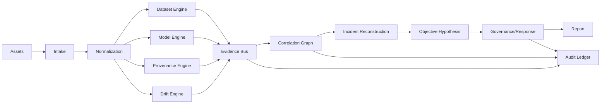

# 02 — System Architecture

## 1. Architectural pattern

CV-TRUST uses a modular pipeline architecture with strict adapters at the boundaries.



## 2. Services/modules

```text
apps/
  api/                    FastAPI HTTP interface
  worker/                 background assessment runner
  verifier/               standalone offline verification CLI
  cli/                    ingestion and audit commands

packages/
  core/                   domain types and interfaces
  ingest/                 COCO/YOLO/model adapters
  data_integrity/         sample + contributor analysis
  model_integrity/        model adapters + behavior tests
  provenance/             signatures, attestation, ledger
  drift/                   shift and OOD analysis
  evidence/               evidence records + graph/correlation
  objectives/              probable objective hypothesis engine
  governance/              finding and disposition logic
  reporting/              JSON/HTML/PDF-ready report data
  storage/                 SQLite repositories
  calibration/             score calibration
```

## 3. Adapter rule

Core modules must not import concrete model classes from the API layer. Instead:

```python
class ModelAdapter(Protocol):
    def inspect(self) -> ModelMetadata: ...
    def predict(self, inputs: list[Image]) -> list[Prediction]: ...
    def capabilities(self) -> CapabilitySet: ...
    def fingerprint(self, battery: ChallengeBattery) -> BehaviorFingerprint: ...
```

Concrete adapters:

- `OnnxAdapter`
- `TorchScriptAdapter`
- `PyTorchStateDictAdapter` where architecture is known/configured
- `BlackBoxAdapter`

## 4. Access modes

```text
                 Model Access
                      │
          ┌───────────┴────────────┐
          ▼                        ▼
      WHITE-BOX                 BLACK-BOX
          │                        │
   weights/graph/acts         input → output
          │                        │
   full diagnostics       behavior-only diagnostics
          │                        │
          └───────────┬────────────┘
                      ▼
              common Evidence API
```

## 5. Offline-first boundary

External network access is prohibited in normal runtime.

```text
                 AIR-GAPPED HOST
┌───────────────────────────────────────────────────┐
│ Frontend → FastAPI → Worker → Analysis Engines   │
│                           ↓                       │
│              Local models / Local storage        │
│                           ↓                       │
│              Audit ledger / reports              │
└───────────────────────────────────────────────────┘
                       X Internet
```

During development only, dependencies may be downloaded into an offline bundle. Runtime cannot require package/model downloads.

## 6. Processing modes

### Synchronous
For small files/quick verification:

```text
upload → validate → scan → result
```

### Asynchronous
For large datasets/models:

```text
submission → job created → worker → evidence events → completed report
```

Use a local job queue backed by SQLite for MVP to avoid an external Redis requirement.

## 7. Evidence bus

Every detector emits a normalized event:

```json
{
  "evidence_id": "EV-...",
  "detector": "near_duplicate",
  "detector_version": "1.0.0",
  "asset_ids": ["IMG-1", "IMG-2"],
  "observation": "embedding_similarity_high",
  "measurements": {"cosine_similarity": 0.97},
  "confidence": 0.91,
  "severity": "medium",
  "limitations": ["embedding_model=local-small-v1"]
}
```

## 8. Correlation strategy

Use a graph where nodes are assets/events and edges represent relationships:

```text
CONTRIBUTOR --submitted--> SAMPLE --member_of--> DATASET
DATASET --used_by--> TRAINING_RUN --produced--> MODEL
MODEL --used_in--> INFERENCE --produced--> OUTPUT
EVIDENCE --about--> any node
EVIDENCE --correlates_with--> other evidence
```

## 9. Deployment modes

### Development
Docker Compose, local persistent volumes.

### Demo
Single workstation, all services local.

### Air-gapped pilot
Offline bundle, local administrator-managed trust anchors, no external service dependency.

## 10. Architecture invariants

- API must not execute arbitrary contributor code.
- Contributor-provided preprocessing must be represented as data/config, not trusted executable logic.
- Model inference must happen in a restricted worker process/container where possible.
- Hash computation must occur before normalization/transformation, with both original and canonical hashes when applicable.
- Audit records must be written after validation of the event schema.
