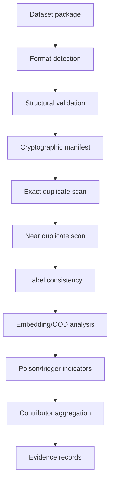

# 03 — Data Integrity Engine

## 1. Goal

Assess a contributed CV dataset without retraining the model and produce sample-level, batch-level and contributor-level evidence.

## 2. Supported ingestion

### COCO
Expected core structures:

```text
images[]
annotations[]
categories[]
```

Validate:

- missing image files;
- duplicate image IDs;
- invalid category IDs;
- malformed bounding boxes;
- coordinates outside image bounds;
- zero/negative width/height;
- orphan annotations;
- duplicate annotations;
- class frequency anomalies.

### YOLO
Support common directory layout:

```text
dataset/
  images/train/
  images/val/
  labels/train/
  labels/val/
  data.yaml
```

Validate:

- label count vs image count;
- class IDs within configured range;
- normalized coordinate range [0,1];
- valid width/height;
- missing labels;
- malformed rows.

## 3. Integrity pipeline



## 4. Exact duplicates

Compute a content hash for raw file bytes:

```text
sha256(file_bytes)
```

Group identical hashes.

Evidence fields:

```json
{
  "duplicate_group_id": "DG-001",
  "hash": "sha256:...",
  "asset_ids": ["IMG-1", "IMG-91"],
  "contributors": ["C01", "C07"]
}
```

## 5. Near duplicates

Use a two-stage strategy:

1. perceptual hash for cheap candidate generation;
2. local image embedding + cosine similarity for confirmation.

Recommended graph:

```text
image → resize/normalize → embedding → nearest neighbours → cluster
```

Do not hard-code one universal threshold. Store threshold + method + encoder version in the evidence record.

## 6. Label integrity

For classification-like labels, compare:

- local visual embedding neighbours;
- cluster label purity;
- class frequency;
- model/reference predictions when a model is supplied;
- annotation consistency.

For object detection labels, inspect bounding-box geometry and overlap patterns.

Use a **multi-signal score**, not a single prediction.

## 7. OOD insertion

Build a declared reference distribution from accepted/reference samples.

Possible score families:

- Mahalanobis distance in embedding space;
- nearest-neighbour distance;
- energy/logit-derived score where model access permits;
- density/cluster membership.

Store:

```text
reference_encoder
reference_dataset_id
score_method
threshold
calibration set
```

## 8. Trigger/poison indicators

Candidate methods:

- representation-space outlier analysis;
- activation clustering when white-box model access exists;
- spectral-signature style analysis;
- repeated visual motif detection;
- target-conditioned association analysis;
- optional trigger search/reconstruction.

These methods are not proofs of malicious intent. Findings should use language such as:

- `POSSIBLE_POISON`
- `LIKELY_POISON`
- `INCONCLUSIVE`

rather than `MALICIOUS = TRUE`.

## 9. Contributor aggregation

Example aggregate:

```text
Contributor C17
├── samples: 12,450
├── structural errors: 7
├── exact duplicates: 112
├── near-duplicate groups: 31
├── label anomalies: 41
├── OOD candidates: 64
├── trigger-like candidates: 13
└── temporal burst: YES
```

The aggregate must preserve the underlying evidence IDs so an analyst can drill down.

## 10. Recommended scoring architecture

Do not use a black-box arbitrary weighted average at first. Produce component scores:

```text
duplicate_score
label_score
ood_score
poison_score
source_concentration_score
temporal_anomaly_score
```

Then use a transparent rule layer for severity. Calibration can be added after attack-lab evaluation.

## 11. Data structures

```python
class DatasetEvidence:
    evidence_id: str
    dataset_id: str
    sample_ids: list[str]
    contributor_id: str | None
    detector: str
    observation: str
    measurements: dict[str, float | int | str]
    confidence: float | None
    severity: str
    limitations: list[str]
```

## 12. Definition of done

- [ ] COCO parser and validator.
- [ ] YOLO parser and validator.
- [ ] raw-byte hashing.
- [ ] exact duplicate groups.
- [ ] near-duplicate candidate groups.
- [ ] label anomaly evidence.
- [ ] OOD evidence.
- [ ] contributor roll-up.
- [ ] detector versioning.
- [ ] deterministic test fixtures for each major anomaly.
