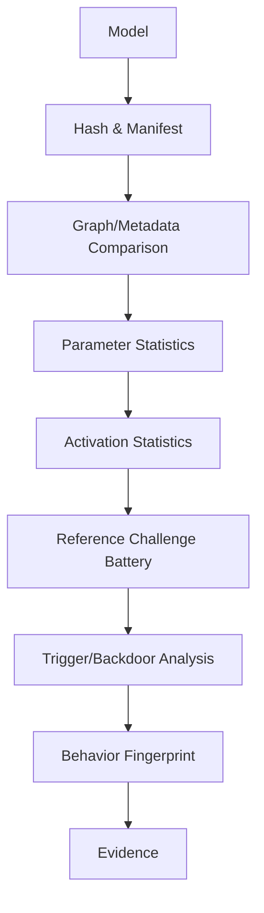
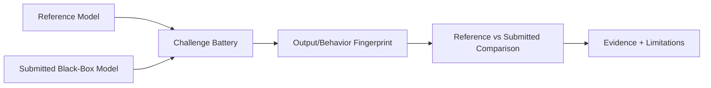

# 04 — Model Integrity Engine

## 1. Goal

Determine whether a supplied vision model is consistent with a trusted/reference identity and behavior, while clearly adapting to available access.

## 2. Model input support

Required:

- ONNX
- PyTorch/TorchScript

Recommended normalized internal metadata:

```text
model_id
format
file_sha256
architecture_family (if inferable)
input_schema
output_schema
operators/layers summary
parameter count (when available)
external data files (ONNX)
access_mode
capabilities
```

## 3. Important distinction

```text
Cryptographic identity
    asks: Is this exact artifact unchanged?

Behavioral integrity
    asks: Does this artifact behave like the expected model?

Semantic safety
    asks: Is the behavior acceptable for the intended operational distribution?
```

No single test answers all three.

## 4. White-box architecture



## 5. Black-box architecture



## 6. Reference challenge battery

Version and hash the battery itself.

Suggested groups:

```text
baseline/
  clean_nominal

robustness/
  brightness
  contrast
  blur
  noise
  resize
  crop
  rotation
  occlusion

boundary/
  OOD samples
  ambiguous samples
  low-light

security/
  synthetic trigger candidates
  perturbation probes
```

The exact transforms must be recorded in the manifest.

## 7. Behavioral fingerprint

For classification:

- predicted class distribution;
- confidence distribution;
- top-k agreement;
- calibration indicators;
- response entropy under perturbation.

For detection:

- number of detections;
- class histogram;
- bounding-box distribution;
- confidence histogram;
- IoU agreement against reference where labels exist;
- output-set similarity.

Store a versioned fingerprint JSON.

## 8. Parameter/architecture analysis

Where white-box access exists:

- tensor count;
- parameter count;
- layer/operator sequence;
- tensor shape consistency;
- weight statistics per layer;
- unusual sparsity/density changes;
- NaN/Inf scan;
- quantization metadata;
- unexpected external weight files.

This is evidence of substitution/modification, not proof of malicious intent.

## 9. Activation analysis

When intermediate outputs are accessible:

- collect activations for a controlled dataset;
- compare reference vs submitted activation distributions;
- search for suspicious small clusters;
- examine target-conditioned activation anomalies.

Avoid requiring retraining.

## 10. Backdoor-like behavior

Potential methods:

- trigger search/reconstruction;
- activation clustering;
- spectral analysis;
- controlled perturbation testing;
- input mixing/STRIP-like runtime analysis where appropriate.

Because no detector is universal, report multiple signals and limitations.

## 11. Graceful degradation

The result must include:

```json
{
  "access_mode": "black_box",
  "available_checks": [
    "behavioral_fingerprint",
    "output_distribution_comparison"
  ],
  "unavailable_checks": [
    "parameter_statistics",
    "activation_analysis"
  ],
  "limitations": [
    "weights not accessible"
  ]
}
```

## 12. Model substitution detection

At minimum:

```text
expected_digest != submitted_digest → identity mismatch
```

Then enrich with:

- architecture mismatch;
- parameter statistics mismatch;
- behavior fingerprint divergence.

## 13. No-retraining requirement

All baseline checks must operate on the contributed model as-is. Optional remediation may train a replacement model, but that must be a separate phase and never a prerequisite for integrity assessment.

## 14. Definition of done

- [ ] ONNX adapter.
- [ ] TorchScript adapter.
- [ ] file digest.
- [ ] architecture/metadata summary.
- [ ] reference challenge runner.
- [ ] behavioral fingerprint.
- [ ] black-box adapter.
- [ ] white-box capability report.
- [ ] at least one trigger-analysis method.
- [ ] model substitution test.
- [ ] no-training baseline test.
