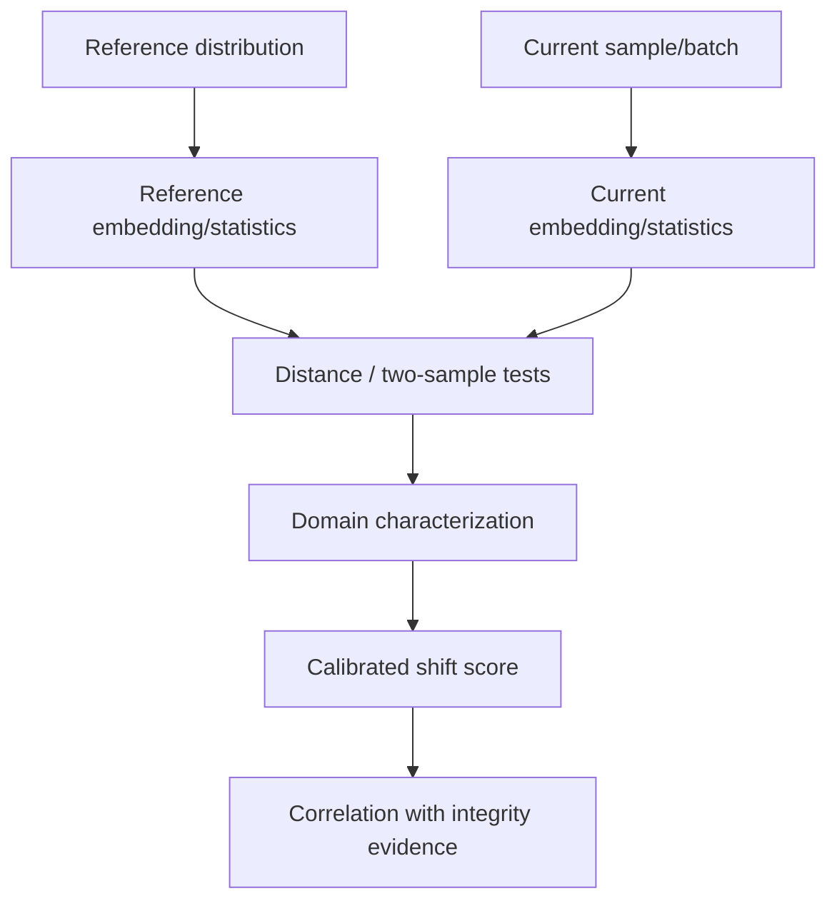

# 06 — Distribution Shift & OOD Engine

## 1. Goal

Measure how deployment/assessment data differs from a declared reference distribution and distinguish likely operational drift from evidence more consistent with manipulation.

## 2. Key principle

```text
Anomalous ≠ malicious
```

Night scenes can differ from daytime scenes without an attacker. Sensor replacement can shift embeddings without a poisoned dataset.

The engine therefore reports both:

- **shift magnitude**;
- **shift characterization**.

## 3. Data pipeline



## 4. Features to track

### Image/vision features

- embedding distributions;
- brightness/contrast;
- image resolution/aspect ratio;
- color statistics;
- blur/noise proxies;
- crop/scale characteristics.

### Operational metadata

- sensor ID;
- location/terrain category where available;
- season/date;
- time of day;
- acquisition pipeline version.

Do not require metadata to exist; mark missingness explicitly.

## 5. Statistical methods

Possible MVP methods:

- Kolmogorov-Smirnov for scalar feature distributions;
- Wasserstein distance;
- population stability index for tabularized indicators;
- MMD for embeddings;
- Mahalanobis distance for sample-level OOD;
- nearest-neighbour distance.

Select a small, stable set rather than implementing every method.

## 6. Domain-shift characterization

Example:

```text
Observed shift
├── brightness: high
├── color temperature: moderate
├── sensor signature: changed
├── embedding distance: moderate
└── label mix: unchanged

Interpretation:
Likely operational/environmental drift
```

Contrast:

```text
Observed shift
├── embedding distance: high
├── one contributor dominates
├── trigger-like samples concentrated in new batch
└── model behavior changes only for matching pattern

Interpretation:
Requires security investigation
```

## 7. Calibration

Risk/confidence must be calibrated on a held-out validation set from the attack lab. Store calibration version and date.

Output:

```json
{
  "score": 0.78,
  "calibration": "isotonic-v1",
  "interpretation": "high_shift",
  "confidence": 0.81
}
```

Do not present raw detector scores as probabilities unless calibration has actually been performed.

## 8. Shift vs attack correlation

The Drift Engine alone should not declare maliciousness. It emits evidence that the Correlation Engine may combine with:

- contributor anomalies;
- model fingerprint divergence;
- trigger evidence;
- provenance tampering;
- temporal concentration.

## 9. Definition of done

- [ ] reference distribution creation.
- [ ] scalar feature drift.
- [ ] embedding drift.
- [ ] sample OOD score.
- [ ] domain metadata support.
- [ ] calibration pipeline.
- [ ] benign drift fixture.
- [ ] suspicious manipulation fixture.
- [ ] clear missing-metadata behavior.
