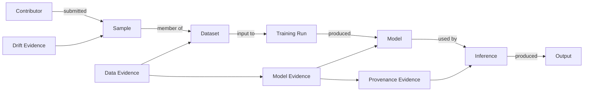

# 07 — Evidence Correlation & Attack Reconstruction

## 1. Goal

Turn isolated detector results into an incident-level explanation.

## 2. Why this layer matters

A near-duplicate cluster, model anomaly and inference anomaly may be unrelated. Correlation looks at shared assets, time, contributors, target classes, triggers and provenance.

## 3. Evidence graph



## 4. Correlation dimensions

### Identity

Do multiple findings reference the same asset digest?

### Temporal

Did anomalies appear immediately before/after a submission or model change?

### Target selectivity

Do the same classes/regions become affected?

### Pattern similarity

Do suspicious samples share an embedding/visual trigger?

### Causal chain

Is there a recorded relationship such as:

```text
submission → training run → model → inference
```

### Alternative explanations

Could all evidence be explained by a known benign change?

## 5. Incident graph construction

Use rule-based correlation first. Example rules:

```text
R1: same model digest + repeated behavior anomaly → model incident candidate
R2: suspicious samples + same contributor + training lineage → data/model correlation candidate
R3: output hash mismatch + valid input/model hashes → output tamper candidate
R4: reused nonce/event ID → replay candidate
R5: high drift + sensor change + no other integrity anomalies → operational drift candidate
```

Avoid an opaque graph neural network for MVP; analysts need explainable edges.

## 6. Attack timeline

Generate a timeline:

```text
09:12  Contributor C17 uploads batch D19
09:15  19 trigger-like samples identified
09:22  Training run T42 begins
09:48  Model M24 created
10:02  Behavioral divergence observed
10:17  Inference records begin showing target-selective anomaly
10:21  Incident correlation created
```

Every timestamp must trace to a source event.

## 7. Blast radius

Traverse graph descendants of an affected asset:

```text
Dataset D19
├── Model M24
│   ├── Deployment A
│   └── Deployment B
└── Model M25
```

Report both confirmed and potentially affected assets.

## 8. Confidence composition

Do not average arbitrary scores. Confidence should be tied to evidence count/independence and calibration.

A finding can expose:

```text
Evidence strength: high
Confidence: 0.88
Independence: 3 detector families
Alternative hypotheses: 2
```

## 9. Definition of done

- [ ] evidence graph schema.
- [ ] relationship store.
- [ ] temporal correlation.
- [ ] target-selectivity analysis.
- [ ] incident clustering.
- [ ] attack timeline.
- [ ] blast-radius traversal.
- [ ] evidence drill-down API.
