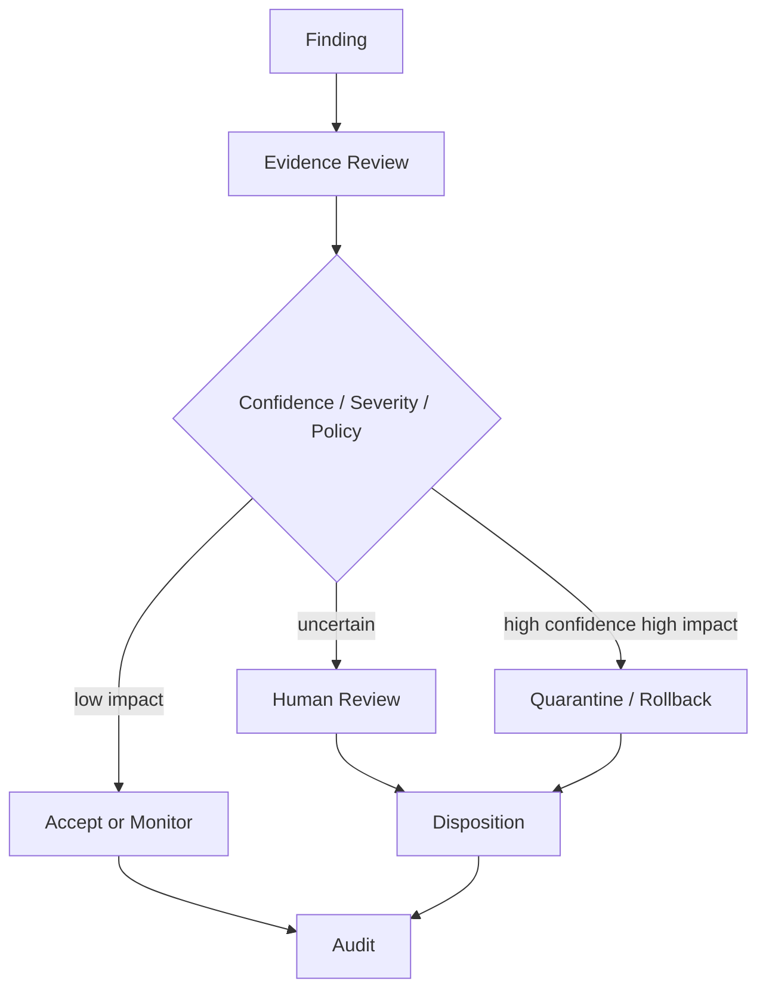

# 09 — Response, Governance & Assurance Reporting

## 1. Goal

Turn evidence into controlled analyst decisions without hiding uncertainty.

## 2. Finding object

Every finding must contain:

```text
finding_id
incident_id
asset_ids
summary
reason
evidence_ids
severity
confidence
access_mode
limitations
objective_hypotheses
blast_radius
disposition_options
created_at
```

## 3. Severity

Use descriptive severity categories:

```text
INFO
LOW
MEDIUM
HIGH
CRITICAL
```

Severity should describe operational/security impact according to configured criteria; it is not a probability.

## 4. Dispositions

```text
ACCEPT
REVIEW
MONITOR
QUARANTINE
ROLLBACK
REMEDIATE
CLOSE
```

The default disposition for uncertain/high-impact findings should be `REVIEW`, unless an administrator explicitly enables automatic quarantine policy.

## 5. Response flow



## 6. Quarantine

Quarantine should be reversible:

```text
asset status:
ACTIVE → QUARANTINED → RESTORED or REVOKED
```

Store the reason and approving user.

## 7. Rollback

For models, preserve previous trusted versions:

```text
MODEL-17 current
MODEL-16 last trusted
```

Rollback must never overwrite forensic evidence. It creates a new disposition event.

## 8. Coverage statement

Generate a machine-readable and human-readable statement:

```text
Supported:
- exact duplicate detection
- near-duplicate detection
- label anomaly detection
- OOD/shift analysis
- model digest mismatch
- behavioral fingerprinting
- inference tamper/replay checks

Limited:
- trigger reconstruction
- activation analysis for unsupported architectures

Unsupported:
- attacks requiring unavailable telemetry
- attribution to a human identity
- guarantees of zero false negatives
```

## 9. Report structure

```text
Executive Summary
Asset Inventory
Trust/Identity Results
Dataset Results
Model Results
Inference Provenance
Distribution Shift
Correlated Incident
Attack Timeline
Probable Objective Hypotheses
Blast Radius
Dispositions
Limitations
Coverage
Audit References
```

## 10. Analyst UI requirements

Every red/orange indicator must be clickable to evidence.

Example:

```text
MODEL M24
Status: REVIEW REQUIRED

Why?
• SHA-256 differs from expected
• behavioral fingerprint divergence 0.31
• selective trigger response observed

Evidence: EV-188, EV-203, EV-221
Access: WHITE-BOX
Limitations: trigger search incomplete
```

## 11. Definition of done

- [ ] finding schema.
- [ ] severity rules.
- [ ] disposition state machine.
- [ ] quarantine records.
- [ ] rollback records.
- [ ] coverage manifest.
- [ ] assurance report generator.
