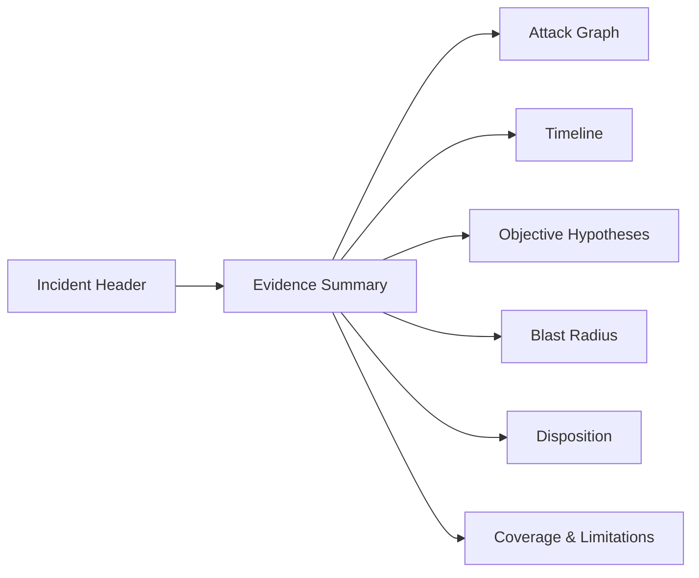

# 11 — Frontend Analyst Console

## 1. Stack

- React
- TypeScript
- Vite
- Tailwind CSS
- React Router
- TanStack Query
- React Flow for evidence graphs
- ECharts/Recharts for distributions and telemetry

## 2. UX goal

This is an **analyst/security console**, not a generic AI dashboard.

Information hierarchy:

```text
Incident state
    ↓
Why was it flagged?
    ↓
What evidence supports it?
    ↓
What assets are affected?
    ↓
What is the likely technical objective?
    ↓
What action is available?
```

## 3. Pages

```text
/dashboard
/assets
/assessments
/findings
/incidents/:id
/models/:id
/datasets/:id
/provenance
/audit
/reports/:id
/settings/capabilities
```

## 4. Dashboard

Show:

- active assessments;
- high/critical findings;
- contributor risk overview;
- model integrity status;
- provenance verification status;
- drift overview;
- recent incidents;
- audit-chain health.

Do not display one giant unexplained "AI trust score".

## 5. Incident page



## 6. Evidence drill-down

Every evidence item should show:

```text
Detector
Version
Observation
Measured values
Threshold/reference
Source assets
Confidence
Limitations
Related evidence
```

## 7. Visual conventions

Use consistent semantics:

```text
INFO     informational
LOW      minor anomaly
MEDIUM   investigation
HIGH     urgent investigation
CRITICAL immediate containment consideration
```

Avoid excessive animation, glowing effects or decorative cyberpunk UI that makes forensic data harder to read.

## 8. Objective panel

Example:

```text
MOST SUPPORTED TECHNICAL OBJECTIVE
Selective conditional manipulation

Supporting evidence
EV-188  Target selectivity 0.92
EV-203  Trigger response 0.87
EV-221  Contributor concentration 0.77

Alternative explanations
• correlated label error
• unknown data-generation artifact

Intent attribution: not established
```

## 9. Disposition panel

Buttons should be explicit:

```text
Accept
Monitor
Review
Quarantine
Rollback
```

A destructive action must require confirmation and create an audit event.

## 10. Offline UI behavior

The UI must not depend on CDN-hosted fonts, icons, scripts or map tiles. Bundle all static resources.

## 11. Definition of done

- [ ] dashboard.
- [ ] assessment monitor.
- [ ] findings table.
- [ ] evidence drawer.
- [ ] incident graph.
- [ ] attack timeline.
- [ ] objective panel.
- [ ] provenance verifier page.
- [ ] audit verification page.
- [ ] report viewer.
- [ ] offline assets bundled.
