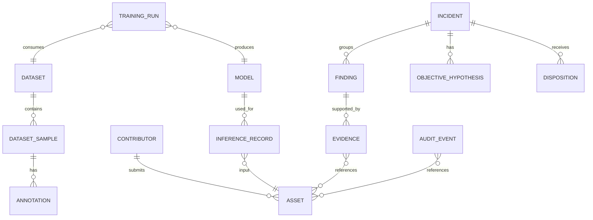

# 12 — Data Models & Schemas

## 1. Canonical entities

```text
Contributor
Asset
Dataset
DatasetSample
Annotation
Model
TrainingRun
InferenceRecord
Evidence
Finding
Incident
ObjectiveHypothesis
Disposition
AuditEvent
CalibrationModel
Capability
Assessment
```

## 2. Entity relationships



## 3. Asset schema

```json
{
  "asset_id": "AST-...",
  "asset_type": "IMAGE|DATASET|MODEL|CONFIG|OUTPUT|BUNDLE",
  "name": "...",
  "sha256": "64-hex",
  "byte_size": 123,
  "source": {
    "contributor_id": "C17",
    "submission_id": "SUB-..."
  },
  "created_at": "...",
  "ingested_at": "...",
  "status": "UNTRUSTED|VERIFIED|QUARANTINED|REVOKED"
}
```

## 4. Evidence schema

```json
{
  "evidence_id": "EV-...",
  "evidence_type": "DATA_ANOMALY",
  "detector": "near_duplicate",
  "detector_version": "1.0.0",
  "access_mode": "WHITE_BOX|BLACK_BOX|FILE_ONLY|N_A",
  "asset_ids": ["AST-1"],
  "observation": "...",
  "measurements": {},
  "baseline": {},
  "decision_rule": "...",
  "confidence": 0.83,
  "severity": "MEDIUM",
  "limitations": [],
  "created_at": "..."
}
```

## 5. Finding schema

```json
{
  "finding_id": "FND-...",
  "incident_id": "INC-...",
  "summary": "...",
  "reason": "...",
  "evidence_ids": ["EV-1", "EV-2"],
  "affected_asset_ids": ["AST-1"],
  "severity": "HIGH",
  "confidence": 0.9,
  "status": "OPEN|UNDER_REVIEW|CLOSED",
  "recommended_disposition": "REVIEW",
  "limitations": [],
  "coverage": {}
}
```

## 6. Objective hypothesis schema

```json
{
  "hypothesis_id": "OBJ-...",
  "type": "SELECTIVE_DEGRADATION",
  "supporting_evidence_ids": ["EV-1"],
  "support_score": 0.82,
  "confidence": 0.79,
  "alternatives": [
    {"type": "ACCIDENTAL_DATA_QUALITY_FAILURE", "confidence": 0.31}
  ],
  "statement": "Evidence is consistent with selective conditional manipulation.",
  "intent_attribution": "NOT_ESTABLISHED",
  "atlas_references": []
}
```

## 7. Audit event schema

```json
{
  "event_id": "AUD-...",
  "sequence": 101,
  "event_type": "ASSET_REGISTERED",
  "timestamp": "...",
  "actor_id": "SYSTEM",
  "subject_ids": ["AST-1"],
  "payload": {},
  "previous_event_hash": "...",
  "record_digest": "...",
  "signature": "...",
  "key_id": "AUDIT-KEY-01"
}
```

## 8. Calibration metadata

```json
{
  "calibration_id": "CAL-...",
  "method": "isotonic",
  "training_data_hash": "...",
  "target_definition": "attack_probability",
  "version": "1.0.0",
  "created_at": "..."
}
```

## 9. Schema rules

- All external IDs are opaque strings.
- All timestamps are ISO 8601 with timezone.
- Digests identify the algorithm explicitly, e.g. `sha256:...`.
- Schema versions are mandatory.
- Enumerations must reject unknown values by default at API boundaries.
- Every stored score has a documented semantic meaning.
