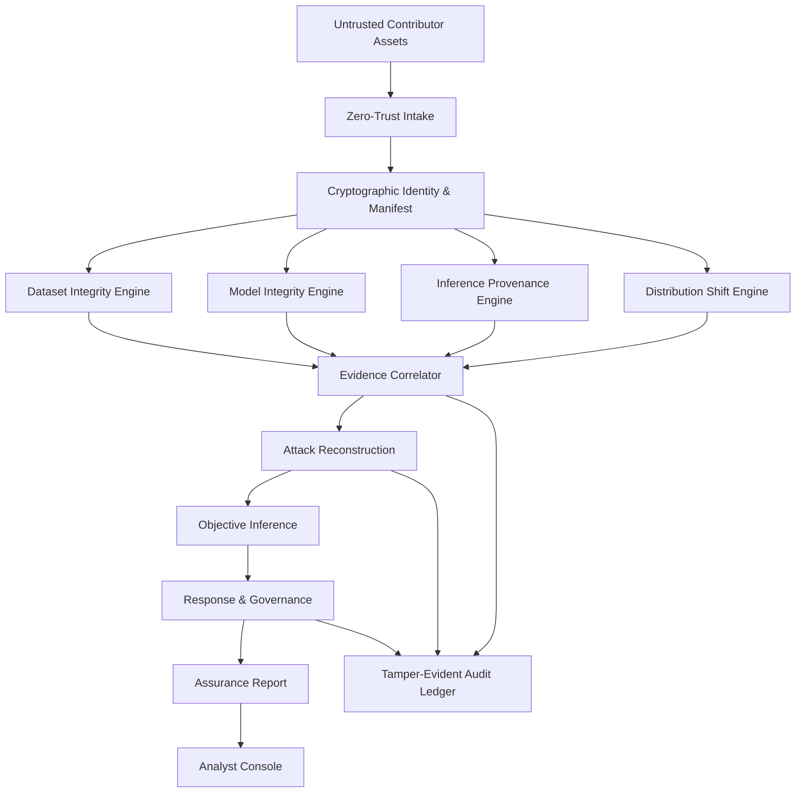

# SIH26228 — CV-TRUST Project Documentation

## Trustworthy Computer Vision Integrity Assurance for Data, Models and Inference Outputs in Multi-Contributor Pipelines

**Problem Statement:** SIH26228  
**Organization:** Ministry of Defence (MoD)  
**Department:** Indian Army (DGIS)  
**Category:** Software  
**Theme:** Blockchain & Cybersecurity  
**Documentation version:** 1.0.0  
**Research baseline:** 30 September 2026

---

## 1. What this repository contains

This documentation package is designed to let multiple coding agents build the project **incrementally** without inventing missing requirements, changing interfaces halfway through the build, or attempting the entire system in one prompt.

The project is divided into independent but connected implementation phases:

| Phase | Document | Primary outcome |
|---|---|---|
| 0 | `00_MASTER_SPEC.md` | authoritative product and technical specification |
| 1 | `01_REQUIREMENTS_TRACEABILITY.md` | SIH requirement-to-feature mapping |
| 2 | `02_ARCHITECTURE.md` | system architecture and module boundaries |
| 3 | `03_DATA_INTEGRITY_ENGINE.md` | COCO/YOLO ingestion + dataset integrity analysis |
| 4 | `04_MODEL_INTEGRITY_ENGINE.md` | ONNX/PyTorch/TorchScript assessment |
| 5 | `05_PROVENANCE_AUDIT_ENGINE.md` | signed inference records + replay/tamper detection |
| 6 | `06_DISTRIBUTION_SHIFT_ENGINE.md` | OOD/drift assessment |
| 7 | `07_EVIDENCE_CORRELATION.md` | evidence graph + incident correlation |
| 8 | `08_ATTACK_OBJECTIVE_INFERENCE.md` | probable attack objective inference |
| 9 | `09_RESPONSE_GOVERNANCE.md` | dispositions, quarantine, rollback and reporting |
| 10 | `10_BACKEND.md` | FastAPI/backend contracts and implementation plan |
| 11 | `11_FRONTEND.md` | React analyst console |
| 12 | `12_DATA_MODELS_AND_SCHEMAS.md` | canonical JSON/database schemas |
| 13 | `13_ATTACK_LAB_AND_EVALUATION.md` | reproducible clean/attack benchmark |
| 14 | `14_OFFLINE_DEPLOYMENT.md` | air-gapped packaging and operations |
| 15 | `15_AGENT_BUILD_PROTOCOL.md` | instructions for coding agents to avoid hallucination |
| 16 | `16_TEST_PLAN.md` | unit/integration/system/security tests |
| 17 | `17_API_CONTRACT.md` | REST/API contract between frontend and backend |
| 18 | `18_RESEARCH_REFERENCES.md` | authoritative references and research notes |

## 2. Read order for agents

Agents should read the files in the following order:

```text
00_MASTER_SPEC
      ↓
01_REQUIREMENTS_TRACEABILITY
      ↓
02_ARCHITECTURE
      ↓
12_DATA_MODELS_AND_SCHEMAS
      ↓
17_API_CONTRACT
      ↓
15_AGENT_BUILD_PROTOCOL
      ↓
PHASE-SPECIFIC DOCUMENT
      ↓
16_TEST_PLAN
```

An agent must not implement a later phase while inventing interfaces that are supposed to be defined by an earlier phase.

## 3. Core product concept

CV-TRUST is an **offline, air-gapped, model-agnostic computer-vision assurance platform**. It establishes evidence about the integrity of:

```text
Contributor → Dataset → Model → Runtime/Inference → Output → Audit trail
```

The project extends the SIH requirements with a forensic layer:

```text
Detect
  ↓
Verify
  ↓
Correlate evidence
  ↓
Reconstruct attack path
  ↓
Characterize impact and blast radius
  ↓
Infer probable attack objective
  ↓
Recommend disposition
  ↓
Preserve tamper-evident forensic record
```

**Important:** the system must not claim to know a person's private motive or identity from technical evidence alone. It produces **probable attack objective hypotheses** grounded in observed evidence, known attack patterns and alternatives.

## 4. High-level block diagram



## 5. Technology stack

| Area | Technology | Why |
|---|---|---|
| Backend API | Python + FastAPI | Strong fit for ML/security tooling and typed REST APIs |
| Core analysis | Python | PyTorch, ONNX Runtime, OpenCV, NumPy, SciPy, scikit-learn |
| Model execution | ONNX Runtime + PyTorch | Supports ONNX and PyTorch/TorchScript reference models |
| Computer vision | OpenCV + Pillow | Decode, validate and transform images |
| Embeddings | Pluggable local encoder (default lightweight torchvision model; optional DINO/CLIP-class encoder) | Near-duplicate, OOD, cluster and behavior features |
| Vector search | FAISS (optional) | Efficient local nearest-neighbour search |
| Statistics | NumPy/SciPy/scikit-learn | Robust anomaly and distribution statistics |
| Cryptography | `cryptography` package; SHA-256 + Ed25519 | Content digests and signatures |
| Provenance format | Custom CV-TRUST attestation inspired by in-toto/SLSA patterns | Structured, verifiable artifact lineage |
| Audit log | SQLite + append-only JSONL/hash chain; periodic Merkle roots | Offline, inspectable, tamper-evident audit trail |
| Evidence graph | SQLite adjacency tables + NetworkX in-memory analysis | Avoid mandatory graph DB dependency in air-gapped MVP |
| Backend validation | Pydantic | Strict schemas at system boundaries |
| Frontend | React + TypeScript + Vite | Mature analyst-console stack |
| UI | Tailwind CSS | Fast construction of dense security dashboard |
| Visualization | ECharts or React Flow + lightweight charting | Evidence graphs, timelines, distributions |
| Desktop packaging | Docker Compose and/or packaged Python environment | Reproducible offline deployment |
| Optional local LLM | Small local instruct model (runtime pluggable) | Human-readable summaries; never the root detector |
| Optional ledger adapter | Permissioned blockchain / Hyperledger-compatible adapter | Optional interoperability, not required for core operation |

## 6. Non-negotiable constraints

1. **No cloud APIs are required at runtime.**
2. **The complete evaluation workflow must work in an air-gapped environment.**
3. Baseline integrity assessment **must not require retraining** of the contributed model.
4. The platform must be **model-agnostic**, not hard-coded to one detector architecture.
5. Required dataset formats include **COCO and YOLO**.
6. Required model formats include **ONNX and PyTorch/TorchScript**.
7. White-box methods must gracefully degrade or clearly report unavailable capability under black-box access.
8. Every analyst-visible finding must contain reason, evidence, confidence/severity, affected asset and disposition.
9. Unsupported attack classes/conditions must be explicitly listed.
10. Every critical event must be auditable and tamper-evident.

## 7. What is deliberately NOT promised

The system does not guarantee perfect attack detection, perfect attribution, or certainty about attacker intent. Backdoor/OOD/drift detection methods have known failure modes and can produce false positives or false negatives. The UI and reports must expose those limitations rather than hiding them.
